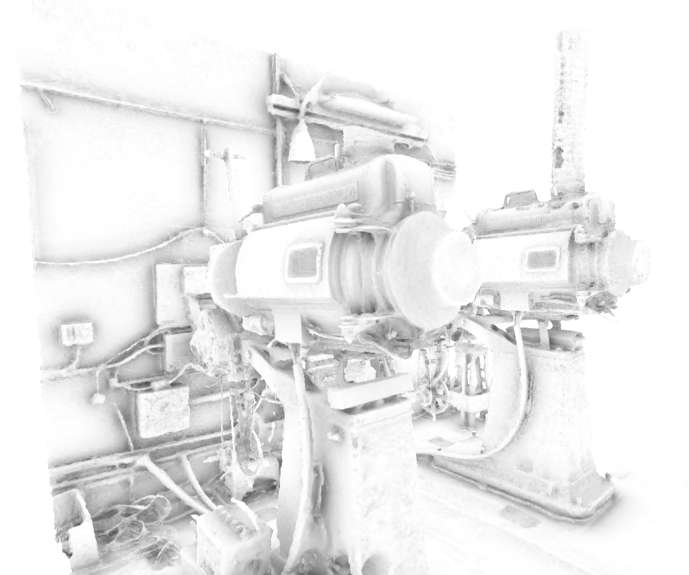

# RTAO

This is an implementation of Ray Traced Ambient Occlusion (RTAO) using DXR. Code is based on a [IntroToDXR Project](https://github.com/acmarrs/IntroToDXR) by Adam Marrs - you should check it out for build instructions and code description.

## How it works

RTAO is meant as a replacement for typical SSAO effects found in many rendering engines, and therefore is implemented in a similar way. It is executed as a post-processing effect in two passes, which are separate from the main geometry rendering pass:
 1. **AO raytracing pass** - uses normals and depth from main rendering pass to reconstruct world space position of visible pixels, and shoots AO rays in a normal-oriented hemisphere from there.
 2. **Filtering pass** - applies temporal filter (box filter) and spatial low-pass filter (gaussian blur) on a noisy result from previous pass
  
AO raytracing pass simply shoots selected number of AO rays, using directions from a pre-calculated sample-set. It uses basic temporal accumulation and filtering - AO is stored for a few previous frames in a cache. Cached values are first aligned with current frame using reverse reprojection (which requires motion vectors from a renderer). A filtering pass then applies a box filter on cached values, and a spatial filter to smooth out the results.
 

## Where to go from now

This is a basic implementation that can (and should) be improved! Try this:

 - Calculate AO in a 'main pass' - if you're using ray tracing for primary rays, you can add secondary AO rays directly to it, avoiding the need to execute another pass specifically for AO - make sure however to use simple closest-hit shader for AO rays, that does not load any materials and uses simple payload structure (just the *T* distance).
 - Implement downsampling - AO can be calculated in a lower resolution than main image. Make sure to execute filtering pass in full resolution to preserve sharpness on geometry edges (prevent unpleasant halo artifacts). Try adding dithering to the low-resolution result to reduce some of the "blockiness"
 - Adaptive sampling - use less samples in a great distance or in dark image areas.
 - Better sample-sets - find sample-sets that yield better visual results, take a look at interleaved sampling
 - Better filtering approaches - both temporal and spatial filters can be adjusted and tuned for specific scenes - dynamic scenes may not like the temporal approaches, but movement will hide noise better.

## References

- *Adam Marrs: **IntroToDXR***
[https://github.com/acmarrs/IntroToDXR](https://github.com/acmarrs/IntroToDXR)
- *Chris Wyman, Shawn Hargreaves, Peter Shirley, Colin Barré-Brisebois: **Introduction to DirectX RayTracing***
[http://intro-to-dxr.cwyman.org/](http://intro-to-dxr.cwyman.org/)
- *Daniel Scherzer, Lei Yang, Oliver Mattausch, Diego Nehab, Pedro V. Sander, Michael Wimmer, Elmar Eisemann: **A Survey on Temporal Coherence Methods in Real-Time Rendering***
[https://www.cg.tuwien.ac.at/research/publications/2011/scherzer2011c/scherzer2011c-pdf.pdf](https://www.cg.tuwien.ac.at/research/publications/2011/scherzer2011c/scherzer2011c-pdf.pdf)
- *John Chapman: **SSAO Tutorial***
[http://john-chapman-graphics.blogspot.com/2013/01/ssao-tutorial.html](http://john-chapman-graphics.blogspot.com/2013/01/ssao-tutorial.html)

## Requirements

* Windows 10 v1809, "October 2018 Update" (RS5)
* Windows 10 SDK v1809 (10.0.17763.0). [Download it here.](https://developer.microsoft.com/en-us/windows/downloads/sdk-archive)
* Visual Studio 2017 or VS Code

## Command Line Arguments

* `-width [integer]` specifies the width (in pixels) of the rendering window
* `-height [integer]` specifies the height(in pixels of the rendering window
* `-model [path]` specifies the file path to a OBJ model

## Licenses and Open Source Software

The code uses three dependencies:
* [TinyObjLoader](https://github.com/syoyo/tinyobjloader-c/blob/master/README.md), provided with an MIT license. 
* [stb_image.h](https://github.com/nothings/stb/blob/master/stb_image.h), provided with an MIT license.
* [dear imgui](https://github.com/ocornut/imgui), provided with an MIT license.

The repository includes assets for use when testing the renderer:
* [Statue Image](https://pixabay.com/en/statue-sculpture-figure-1275469/), by Michael Gaida, licensed under a [CC0 1.0 Creative Commons Universal Public Domain Dedication License](https://creativecommons.org/publicdomain/zero/1.0/deed.en). 
* [Peerless Magnarc Cinema Projectors](https://sketchfab.com/models/62046af7d4f84b4ebe01d44f54970bc1), by Miguel Bandera, licensed under a [Creative Commons Attribution 4.0 International License](https://creativecommons.org/licenses/by/4.0/). 

